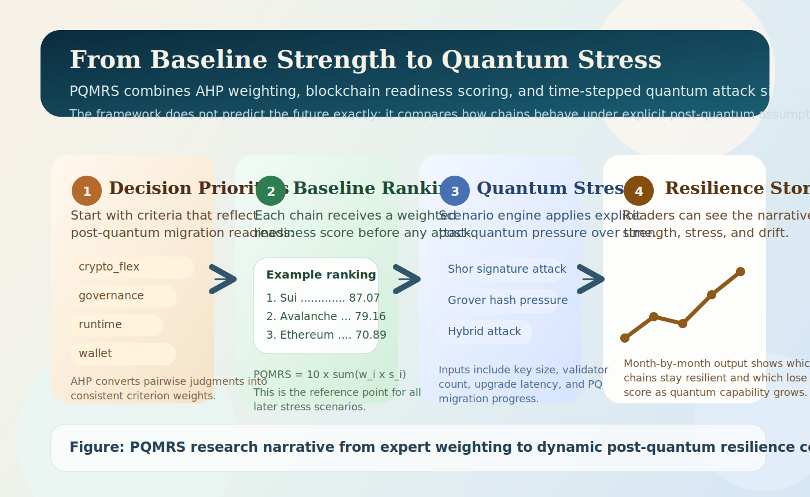

# PQMRS: Post-Quantum Migration Readiness Score

## Abstract
We present a reproducible framework for evaluating blockchain readiness for post-quantum cryptographic migration by integrating Analytic Hierarchy Process (AHP) with a weighted readiness score (PQMRS).

## Visual Story

Figure 1. Research narrative for PQMRS, showing how expert weighting, baseline scoring, and quantum attack scenarios combine into a dynamic resilience comparison.

## Contributions
1. Formal decision model with explicit criteria weighting.
2. Consistency-validated judgments via CI/CR.
3. Transparent, reproducible Rust implementation.
4. Cross-chain comparative evaluation framework.

## Formula
$PQMRS = 10 \sum_i w_i s_i$

## Reproducibility
All experiments are data-driven from:
- `data/ahp_matrix.json`
- `data/chains.csv`

Computations are implemented in Rust under `src/`.
